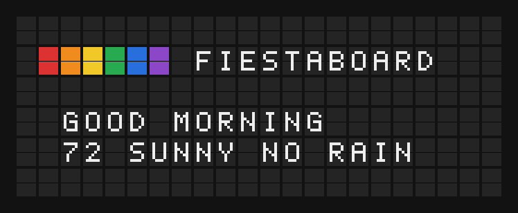

# Vestaboard Plugin

Drive a Vestaboard Flagship, Note or Note array from FiestaBoard, over the Local API or Vestaboard's cloud.



**→ [Setup Guide](./docs/SETUP.md)**

## Overview

The Vestaboard plugin is an output plugin: it moves the frames FiestaBoard renders onto a Vestaboard. It reaches the board one of four ways — the Local API on your network, the Read/Write Cloud API, the note-array Cloud API, or a note array driven Note by Note over each Note's Local API — and FiestaBoard keeps the policy (send floor, dedupe, transitions) while this plugin talks to the hardware.

## Template Variables

An output plugin exposes no template variables. Every page and template you write renders on a Vestaboard board; the board's size (Flagship 6×22, Note 3×15, or a note array) decides how much fits.

## Example Templates

Colour tiles and text, on a Flagship:

```jinja
{center}{red}{orange}{yellow}{green}{blue}{violet} FIESTABOARD

{center}GOOD MORNING
{center}{{weather.temperature}} {{weather.condition}}
```

## Configuration

Board settings (stored on the board):

| Setting | Type | Description |
|---------|------|-------------|
| `api_mode` | `local` \| `cloud` | How FiestaBoard reaches the board. |
| `host` | string | The board's IP address or hostname (Local API). |
| `port` | integer | The Local API port. Default `7000`. |
| `local_api_key` | secret | The Local API key the board issued. |
| `cloud_key` | secret | The Read/Write API key from Vestaboard's web app (cloud). |
| `note_array_token` | secret | The note-array Cloud API token. |
| `tiles` | list | A local note array's Notes: `row`, `col`, `host`, `port`, `local_api_key`, `enabled`. |

The board's shape — `device_type` (`flagship`, `note`, `note_array`) and, for a note array, `notes_wide` / `notes_tall` — is part of the board, not of this plugin's settings.

### The settings screen

FiestaBoard draws this board's settings screen from `manifest.json` alone (its board settings contract, no plugin UI code), in Settings → Hardware and in the setup wizard:

- **Connection** — Local API or Cloud API, as two cards (`mode-cards`).
- **Flagship and Note** — Local API: the board's IP address with a network scan (`device-picker`, the `discover` action), its Local API key, and the port under Advanced. Cloud API: the Read/Write API key.
- **Note array** — Local API: one slot per Note (`tile-grid` sized by the board's layout); each slot takes its Note's address, key and port, and can **Identify** (flash its position) or **Get API Key from Board**. Cloud API: the Cloud API token.
- **Actions** — Test Connection; Get API Key from Board (trades an enablement token for a Local API key, which fills the key field); Auto-detect from board (reads the layout and applies the type and size; not for a local note array, whose size is its tiles).

Which fields show depends on the connection and on the board's shape (`ui:visible_when` with the board's `@device_type`). Every key and token is a secret: shown as `***` once saved and never logged.

Environment variables:

| Variable | Description |
|----------|-------------|
| `VESTABOARD_RW_API_URL` | Points cloud boards at another Read/Write API (a dev mock). |
| `VESTABOARD_CLOUD_API_URL` | Points note-array boards at another Cloud API (a dev mock). |

## Features

- Local API writes with the board's own transitions (Wave, Drift, Curtain, row, diagonal, random)
- Read/Write Cloud API and note-array Cloud API, each held to Vestaboard's one-message-per-15-seconds limit by FiestaBoard
- A Cloud API `429 Too Many Requests` holds sends for the `Retry-After` the cloud asked for
- Local note arrays: one POST per Note, a partial write when a Note fails, and a retry that re-sends only the failed Notes
- Board discovery on your network (mDNS and a port scan of the Local API)
- Connection checks with plain-English troubleshooting, and network diagnostics
- Local API enablement: trade an enablement token for a Local API key
- Identify: flash each Note's position on it

## Author

FiestaBoard
